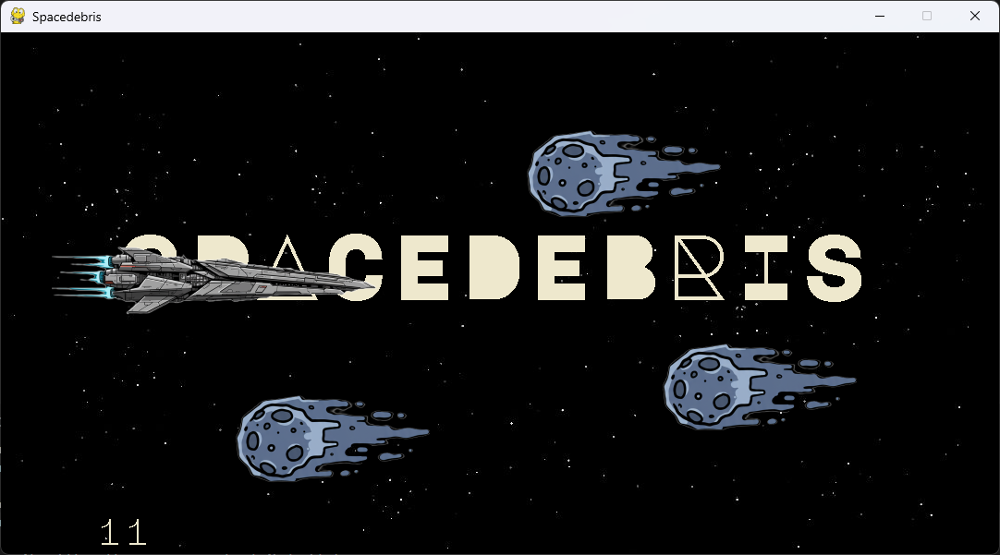

# Spacedebris

Spacedebris is a simple yet exciting game built using Python's **Pygame** library. I created this game to learn the basics of Python and Pygame.
The goal is to **evade incoming meteors** while controlling your **spaceship**.

## 🎮 Gameplay

* Control your spaceship using the **mouse**.

* Dodge the incoming **meteors** to survive as long as possible.

* If you collide with a meteor, the game **exits** with black screen.

## 🛠 Features

* **Game elements generated using Gemini Image Generation Tool**.

* **Smooth player movement** with mouse tracking.

* **Randomized meteors** for unpredictable gameplay.

* **Collision detection** that exits the game on impact.

## 📥 Installation & Setup

### Prerequisites

Make sure you have **Python 3.x** installed along with Pygame:

```
pip install pygame
```
### Run the Game

```
python main.py
```

## Screenshots



## 🚀 Future Improvements

* Implement **startscreen** and **endscreen**

* Implement **power-ups and shields**

* Introduce **different meteor speeds and patterns**
